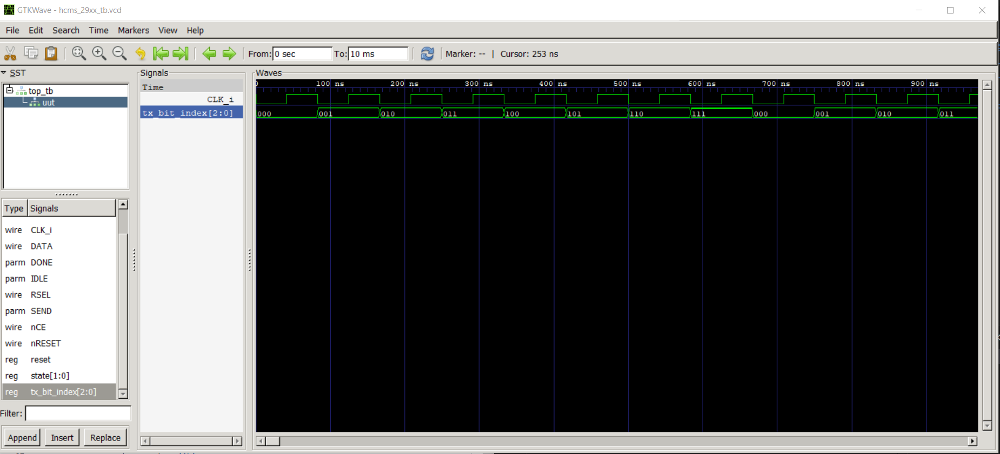
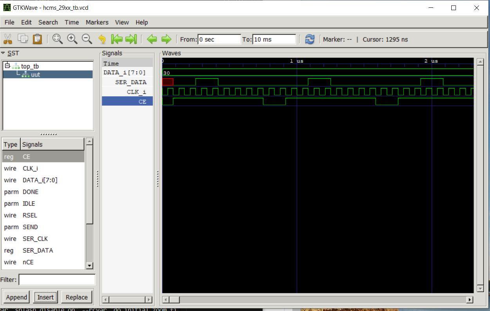
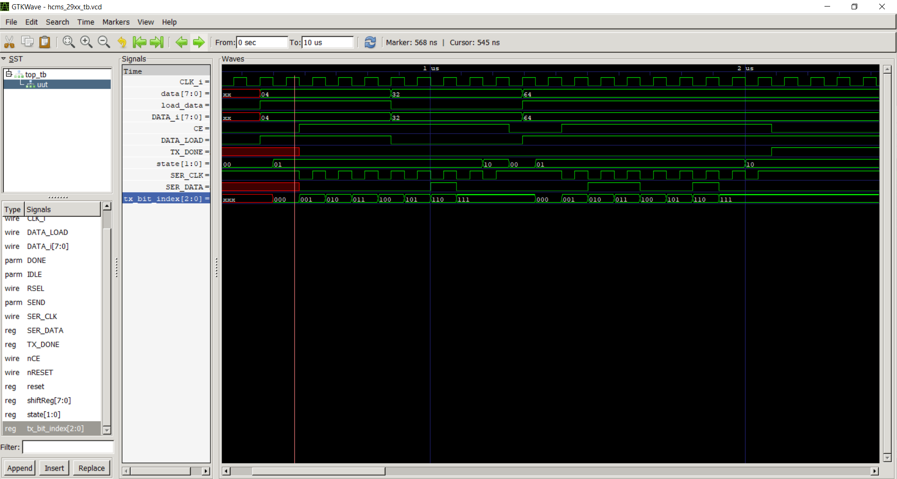
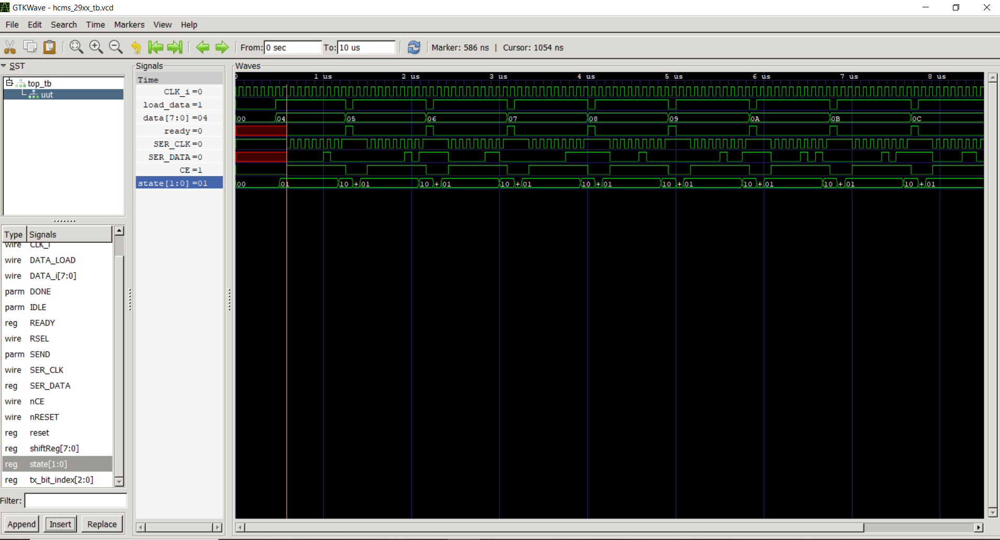
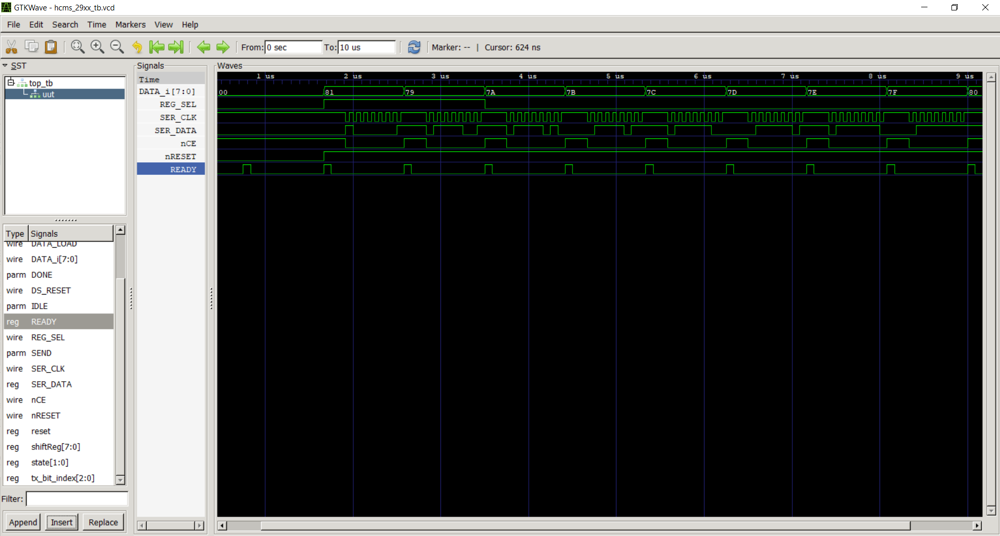
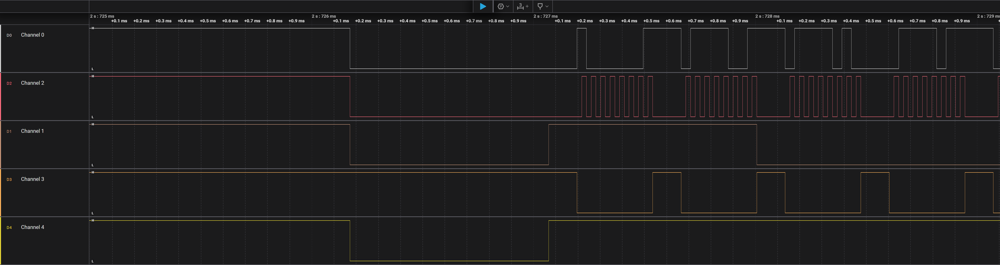
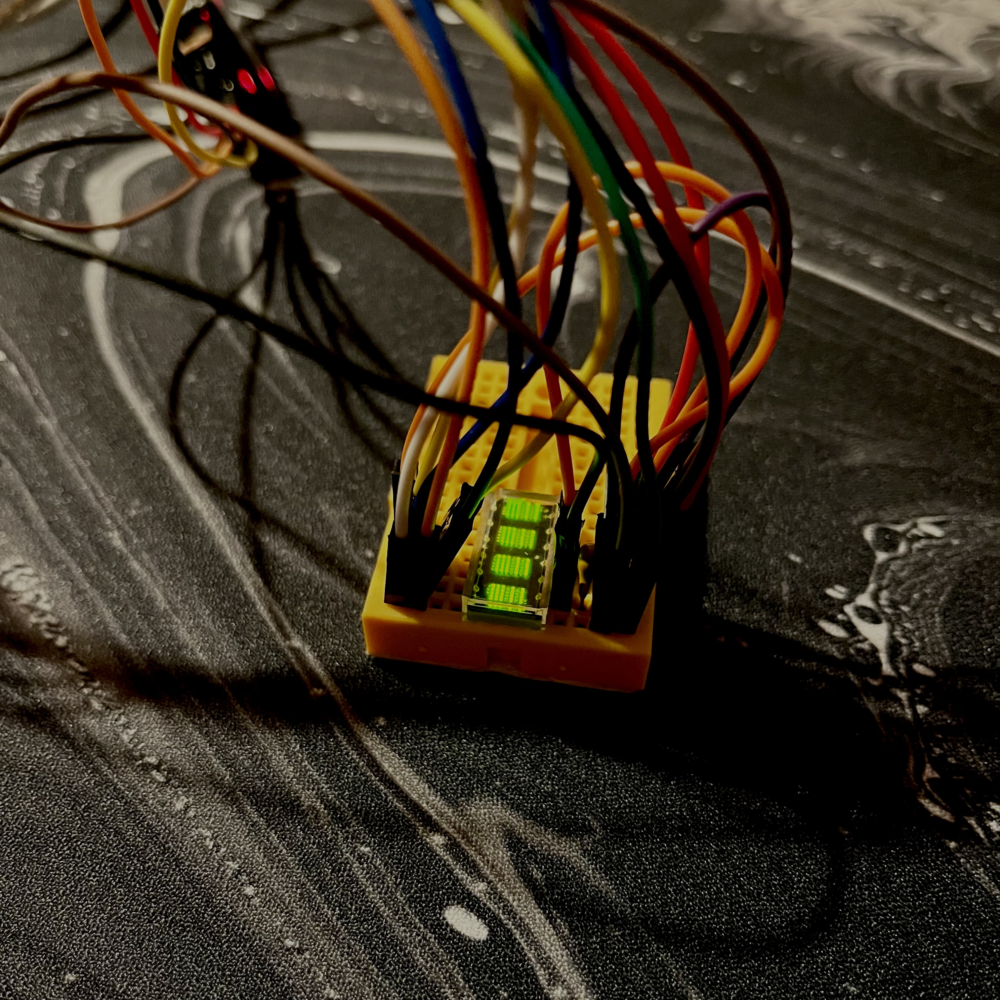
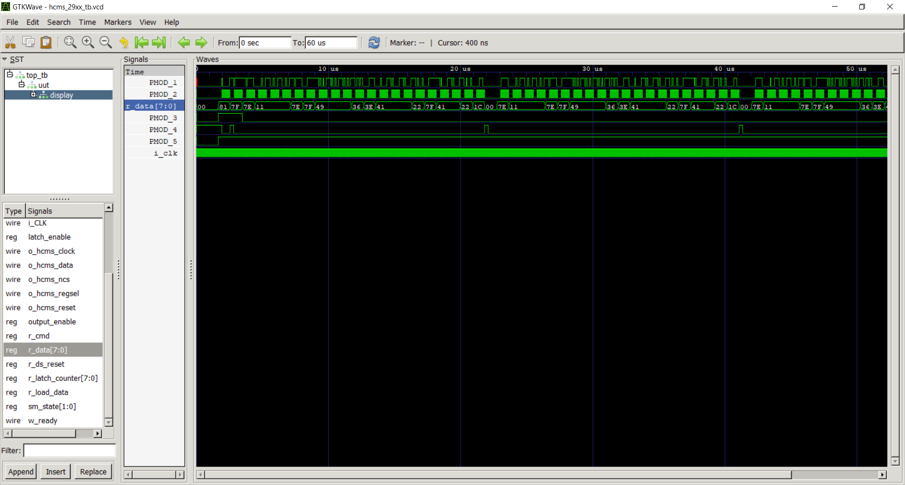
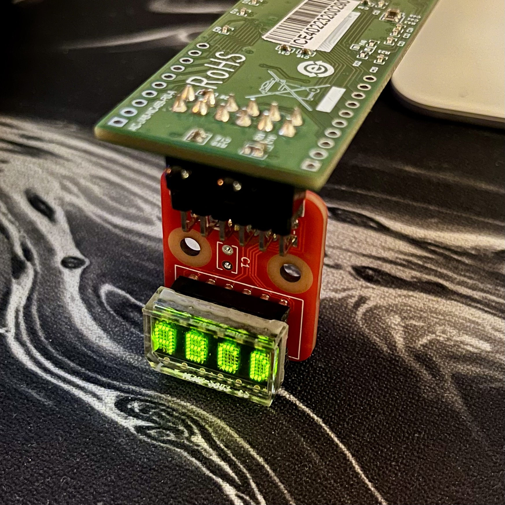

HMCS-29xx data sheet: https://docs.rs-online.com/9f8b/0900766b8133c15f.pdf


'







hcms29xx full control 










Verilog naming conventions: https://nandland.com/coding-style-guidelines-for-vhdl-verilog/




## UART text streaming

This project now accepts display-column bytes from FTDI UART (`RX_FROM_FTDI`, 115200 baud).

- The FPGA stores incoming bytes into the 20 display columns.
- Sending `\n` (0x0A) or `\r` (0x0D) resets write position to column 0.
- Font mapping is done on the PC side.

### Python sender

Use the new script:

```bash
python3 serial_text_sender.py --port /dev/cu.usbserial-20122301 --text "HELLO FPGA"
```

Send one static frame:

```bash
python3 serial_text_sender.py --port /dev/cu.usbserial-20122301 --text "TEST" --once
```

Send pre-mapped raw bytes directly:

```bash
python3 serial_text_sender.py --port /dev/cu.usbserial-20122301 --bytes "0x7E,0x11,0x11,0x11,0x7E"
```