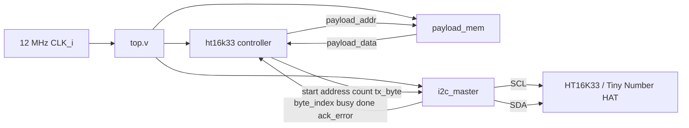
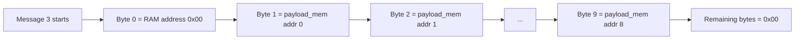
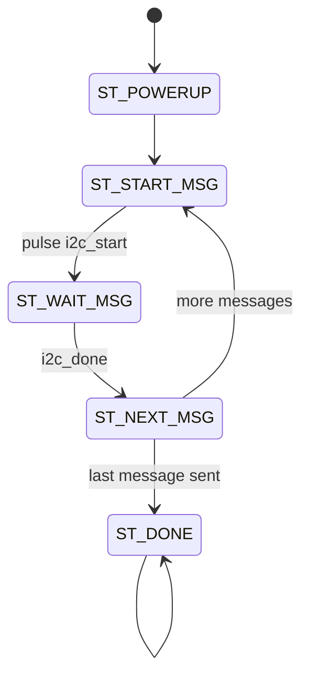
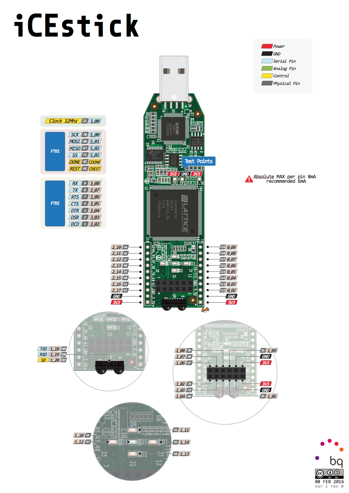

# I2C Tiny Number HAT Demo

This project drives TinyNumberHat from the iCEstick over I2C.

This FPGA repo contains the Verilog-side bring-up and display-driving logic for that hardware.

The current design is split into small modules:

- `top.v`: top-level wiring
- `ht16k33.v`: HT16K33 controller and initialization sequence
- `i2c_master.v`: generic byte-stream I2C write transmitter
- `payload_mem.v`: display payload memory holding segment bytes

The demo currently writes digits `1` to `9` to the display after power-up.

## What the design does

1. Waits for power-up stabilization.
2. Sends HT16K33 initialization commands:
   1. `0x21` oscillator on
   2. `0x81` display on, blink off
   3. `0xEE` brightness command
3. Sends one display RAM write starting at address `0x00`.
4. Reads payload bytes from external payload memory.
5. Holds the final frame on the display.

## Module structure



## Separation of responsibilities

### `ht16k33.v`

This module is device-specific logic.

- knows the HT16K33 I2C address (`0x70`)
- knows the init commands
- knows that display RAM write starts at `0x00`
- requests bytes from payload memory
- starts each I2C transaction through the external transmitter interface

This is the right place for LED-driver-specific behavior.

### `i2c_master.v`

This module is transport logic only.

- generates START and STOP
- shifts out address and payload bytes
- samples ACK/NACK
- exposes `byte_index`, `busy`, `done`, and `ack_error`

It does not know anything about HT16K33 or segment encoding.

### `payload_mem.v`

This module provides display payload bytes.

- address `0` returns segment byte for `1`
- address `1` returns segment byte for `2`
- ...
- address `8` returns segment byte for `9`
- other addresses return `0x00`

This makes it easy to replace the constant payload with writable RAM, a counter, UART input, or another controller later.

## Display write layout

The last message sent by `ht16k33.v` contains 17 bytes:

1. RAM pointer byte `0x00`
2. 16 display RAM bytes

Right now the payload memory populates the first 9 payload slots with segment values for `1..9` and leaves the remaining slots blank.



## Controller state flow



## Build and upload

From this folder:

```bash
apio build
apio upload
```

Note: `apio.ini` still uses a legacy `[env]` section. It works, but renaming it to `[env:default]` would match newer Apio conventions.

## Pin mapping

From `i2c.pcf`:

- `CLK_i` -> pin `21`
- `SCL_PIN` -> pin `80` with pull-up enabled
- `SDA_PIN` -> pin `81` with pull-up enabled

