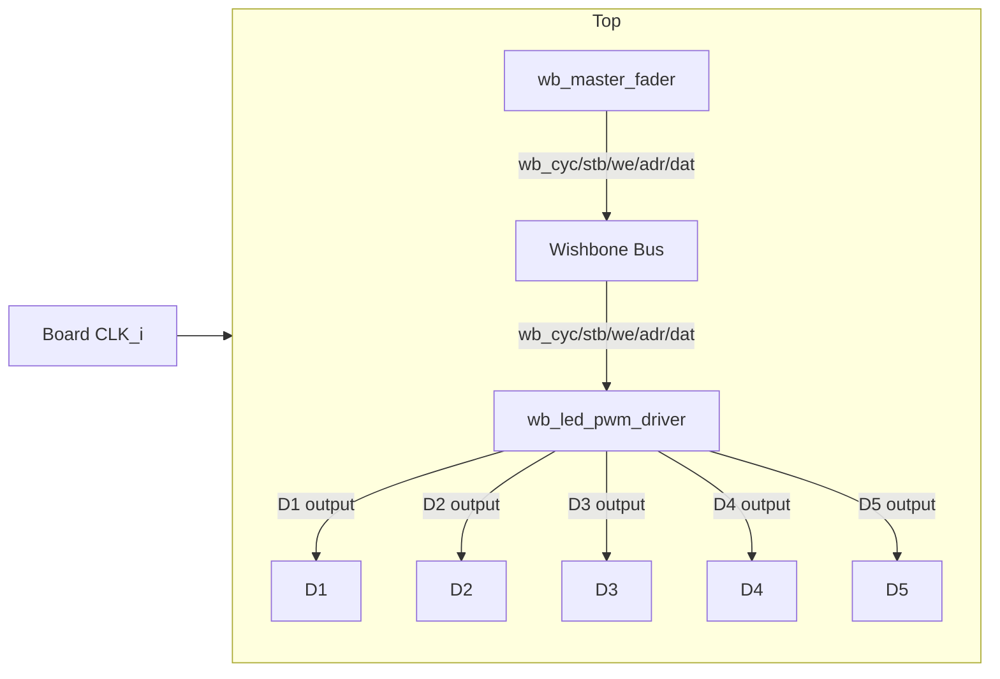
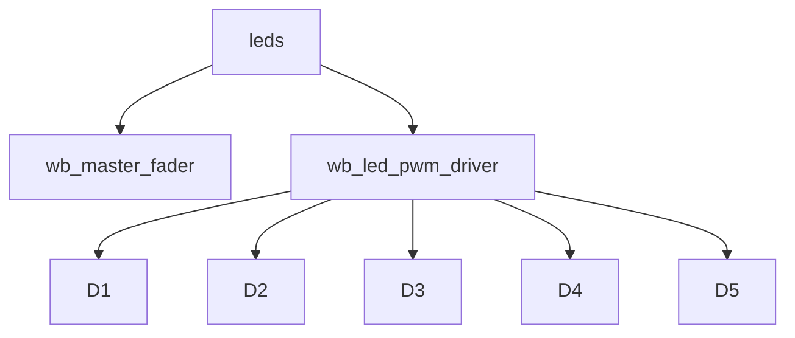

Turn on D1-D5 leds on iCEstick board

This folder contains a small demonstration design for the iCEstick board that
implements a tiny Wishbone-based LED PWM peripheral and  Wishbone
master demo that fades LEDs in/out automatically

Contents
- `leds.v` — top-level design, `wb_led_pwm_driver` (slave) and `wb_master_fader` (demo master).
- `leds_tb.v` — simulation testbench (use `apio test`).
- `leds.pcf` — pin constraints mapping `D1..D5` and `CLK_i` to board pins.

Overview
--------
The design implements:

- A Wishbone PWM slave (`wb_led_pwm_driver`) exposing five 8-bit registers
	(addresses 0..4). Each register controls the duty cycle of one LED (D1..D5).
- A tiny Wishbone master (`wb_master_fader`) used only in the demo top-level
	to write changing PWM values to the slave, producing staggered fade animations.
- A small power-on reset so registers initialize deterministically on hardware.

Address map
-----------
- `0` — D1 PWM (8-bit)
- `1` — D2 PWM (8-bit)
- `2` — D3 PWM (8-bit)
- `3` — D4 PWM (8-bit)
- `4` — D5 PWM (8-bit)

PWM behavior
------------
The slave implements an 8-bit free-running counter and drives each LED with
``(counter < pwm_reg)``. Duty cycle = `pwm_reg / 255`.

Module hierarchy and dataflow
----------------------------
Use these diagrams to quickly understand how the pieces fit together.

Dataflow


Module hierarchy


Build & test
------------
- Simulate:
```bash
cd leds
apio test
```

- Build and upload to hardware (apio + programmer configured in `apio.ini`):
```bash
cd leds
apio build
apio upload
```

Control and usage
-----------------
- Demo mode: the top-level `leds` module includes `wb_master_fader` that
	automatically writes PWM values into the slave to create fades. No external
	CPU is required for the demo.
- Manual control: to set a LED duty cycle from a Wishbone master, write an
	8-bit value to the corresponding address (0..4).
- Readback: read the same address to get the currently stored PWM value.

