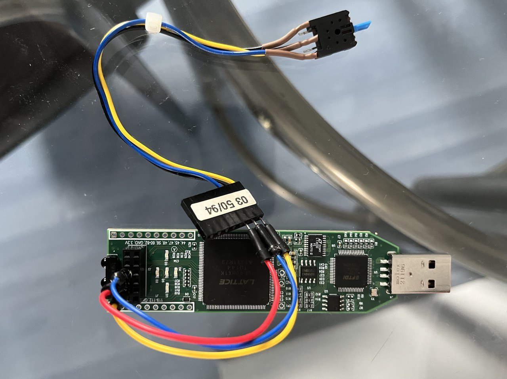

## Simple verilog fpga pwm generator 
Duty cycle 0xfe

Duty cycle 0x0e

Auto  incrementing pwm duty cycle

 
<b>New version reads +/- buttons connected to PMOD port pins PMOD_3 and PMOD_4 and increment or decrement PWM duty cycle</b>

Switch is salvaged from and old 5.2 inch cd drive 