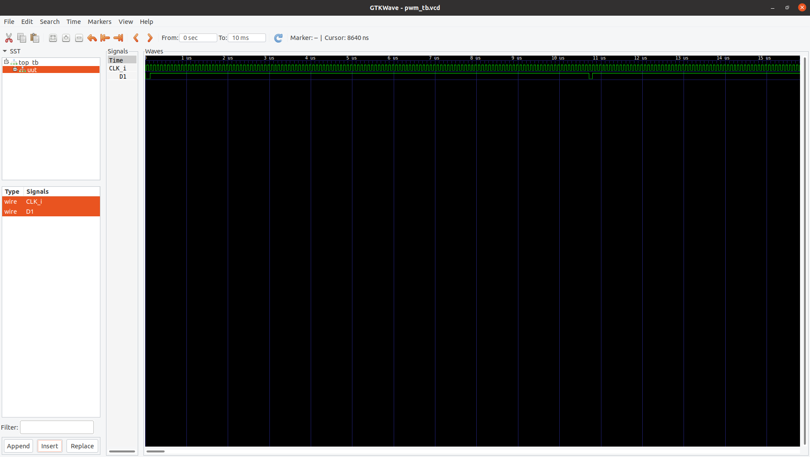
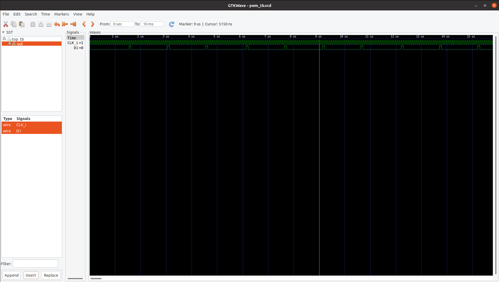

## Simple verilog fpga pwm generator 
Duty cycle 0xfe

Duty cycle 0x0e

Incrementing pwm duty cycle

New version reads +/- buttons connected to PMOD port pins PMOD_3 and PMOD_4 and increment or decrement PWM duty cycle