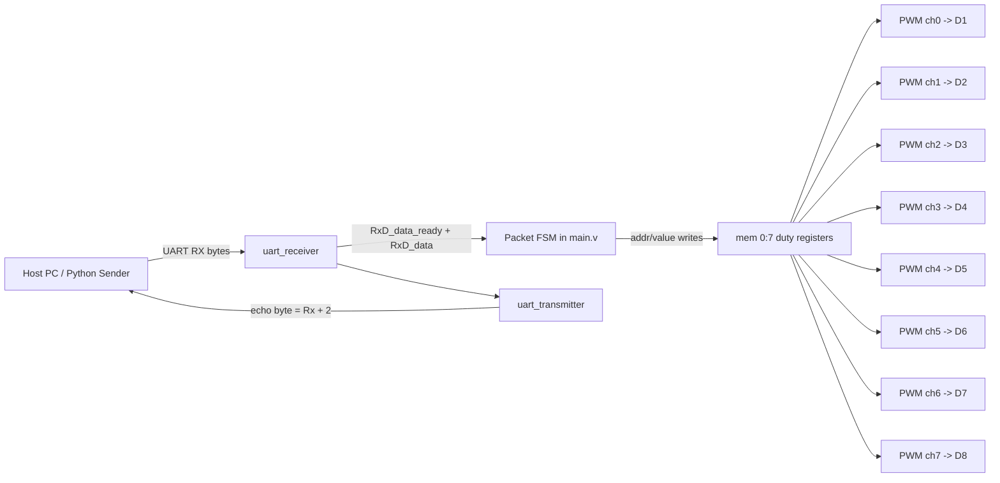
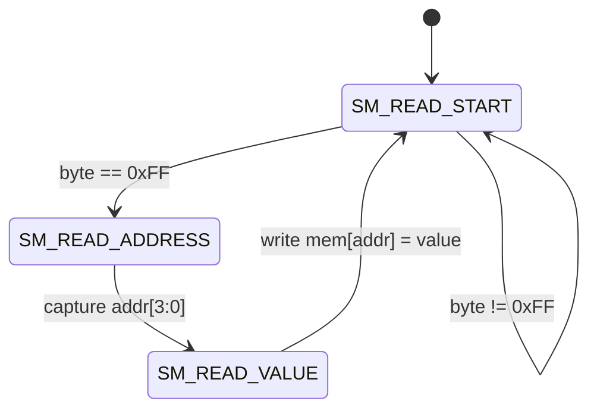

# UART PWM Controller (iCEstick)

This project receives UART bytes from FTDI, updates an internal PWM register bank, and drives 8 LED outputs with independent duty cycles.

## What this design does

- Clock: 12 MHz from iCEstick (`CLK_i`)
- UART RX/TX: 115200 baud (`RX_FROM_FTDI`, `TX_TO_FTDI`)
- LED channels: 8 PWM outputs mapped to `D1..D8`
- PWM width: 8-bit per channel (`0..255` duty input)
- Echo/debug: every received byte is retransmitted as `Rx + 2`

Main source files:

- `main.v`: top-level integration, packet parser, register bank, PWM instantiation
- `uart.v`: UART receiver/transmitter and baud tick generator
- `pwm.v`: 8-bit accumulator PWM core
- `serial_sender.py`: host-side sender example

## Top-level module architecture



## UART write protocol used by `main.v`

The packet parser in `main.v` uses a 3-byte frame:

1. `0xFF` start flag
2. address byte (lower nibble used, `addr = byte[3:0]`)
3. value byte (`0..255` duty)

If address is `0..7`, channel `D1..D8` duty changes accordingly.

### Parser state diagram



## PWM core behavior

`pwm.v` uses an accumulator PWM:

- `acc <= acc[7:0] + PWM_in`
- output is MSB: `PWM_out = acc[8]`

This is a compact FPGA-friendly PWM implementation.

## Build and upload

From this folder:

```bash
apio build
apio upload
```

## Pin mapping summary

From `uart-pwm-controller.pcf`:

- UART:
  - `TX_TO_FTDI` -> pin 8
  - `RX_FROM_FTDI` -> pin 9
- LEDs:
  - `D1..D5` -> pins 99, 98, 97, 96, 95
  - `D6..D8` -> pins 79, 80, 81
