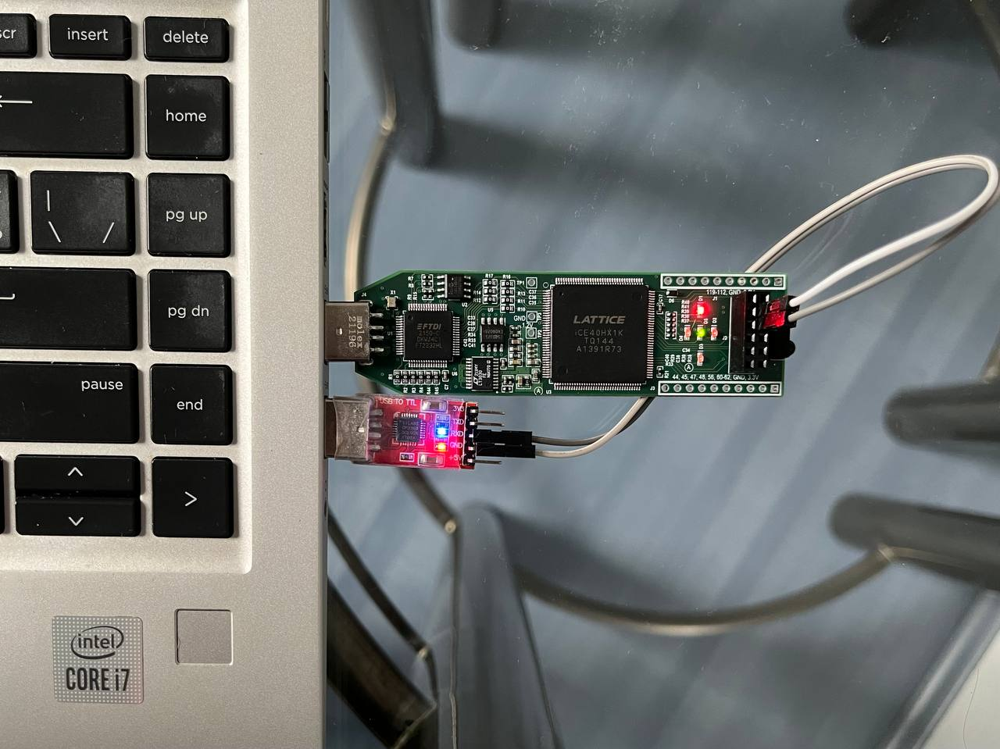
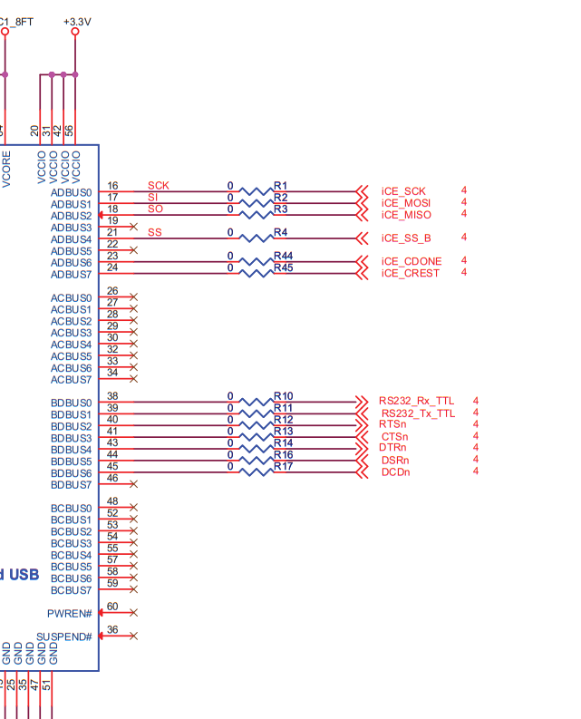
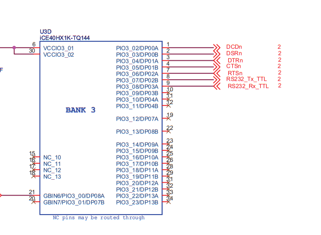

# UART transmitter 
- ## TX
    Time diagram 2 stop bits
    

    ```
    picocom -b 115200  /dev/ttyUSB0

    to set 2 stop bits press 
    Ctrl+j 2 Enter 

    ```
    

    <br>
    To exit from picocom press Ctrl+a flowwed by Ctrl+x

    <br>
    To see device utilisation statistics build with -v flag 

    ```
        apio build -v 
    ```
    Output will contain device utilisation data along another info
    ```
    ...
    Info: Device utilisation:
    Info:            ICESTORM_LC:    37/ 1280     2%
    Info:           ICESTORM_RAM:     0/   16     0%
    Info:                  SB_IO:     4/  112     3%
    Info:                  SB_GB:     2/    8    25%
    Info:           ICESTORM_PLL:     0/    1     0%
    Info:            SB_WARMBOOT:     0/    1     0%
    ...
    ```
    <br>
    Connection:

    Icestick runs uart tx logic connected to  simple 
    cp2102 usb to serial adapter receiving serial data

    

<br>
Increment asci symbol after each end of transfer:


```
abcdefghijklmnopqrstuvwxyz{|}▒▒..

```


Use second serial port on the ft2232h instead of external cp22x dongle 


FTDI             |  FPGA
:-------------------------:|:-------------------------:
  |  

<br>
On host machine Use second serial device for UART communications.